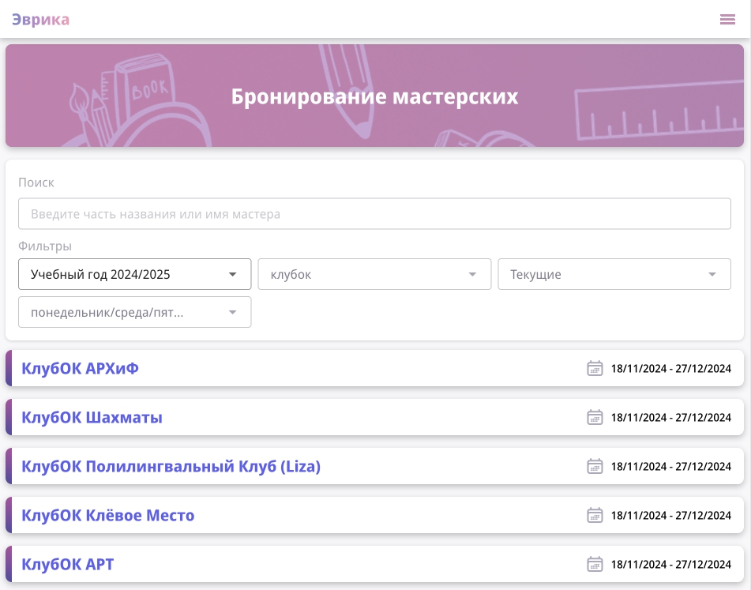
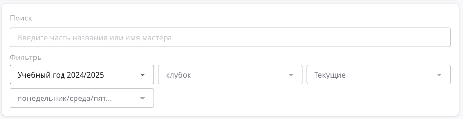
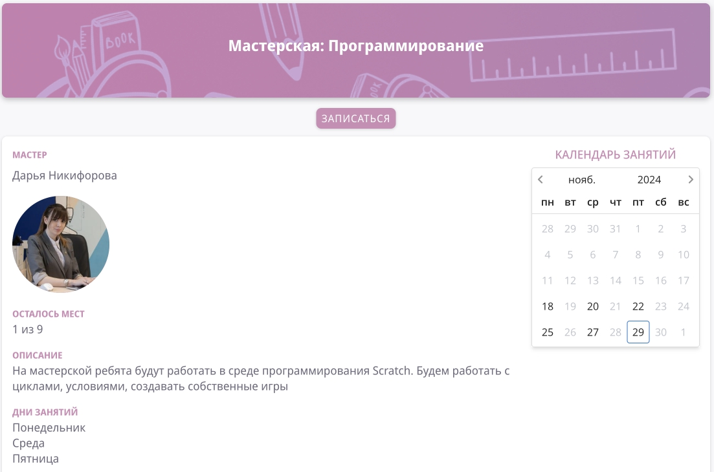

# Мастерские

*Страница со списком мастерских*

## Найти мастерскую

1. Перейдите на [страницу бронирования мастерских](https://school.eurekacenter.ru/workshops/published/booking)

2. Для поиска вы можете воспользоваться **СТРОКОЙ ПОИСКА** или **ФИЛЬТРАМИ**, а так же просто полистать список всех мастерских;

*Строка поиска и фильтры на странице со списком мастерских*

## Записаться на мастерскую

1. Перейдите на [страницу бронирования мастерских](https://school.eurekacenter.ru/workshops/published/booking)

2. Нажмите на нужную мастерскую в списке для перехода страницу мастерской;

*Страница мастерской*

3. Наверху страницы будет либо кнопка **ЗАПИСАТЬСЯ** либо **ОПОВЕЩЕНИЕ** о том, что записи нет;

*Кнопка Записаться*

*Оповещение о том, что записи нет*

4. Нажмите на кнопку **ЗАПИСАТЬСЯ**

> Система оповестит вас всплывающим окошком о результате записи
